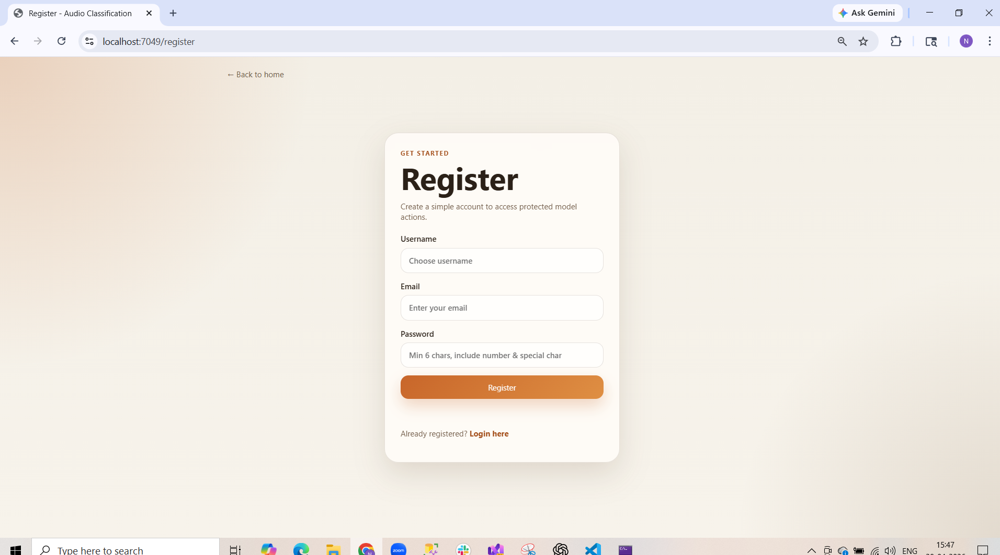
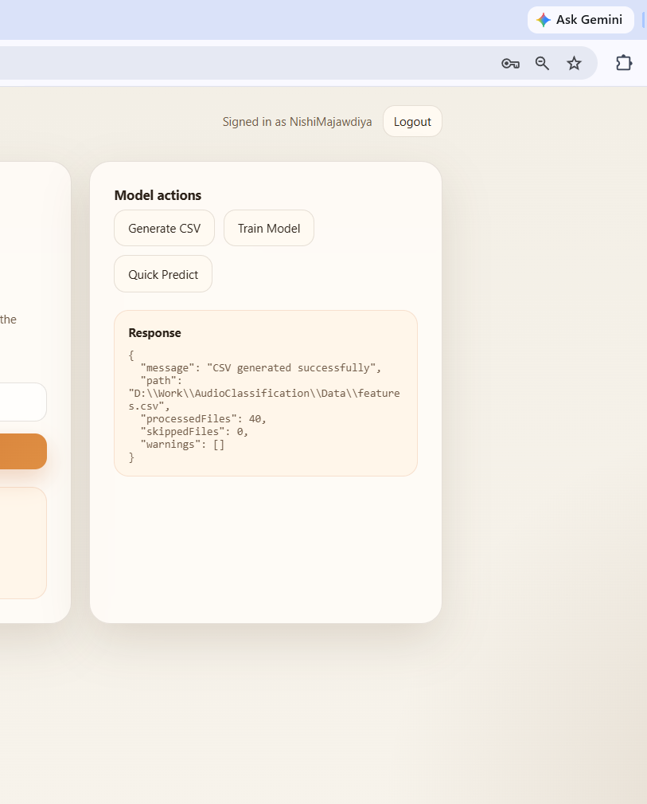
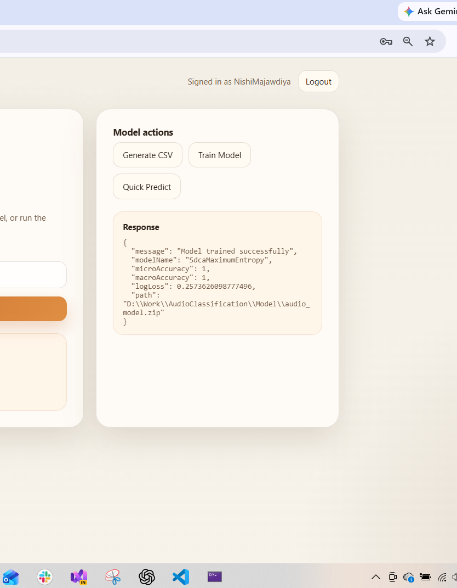
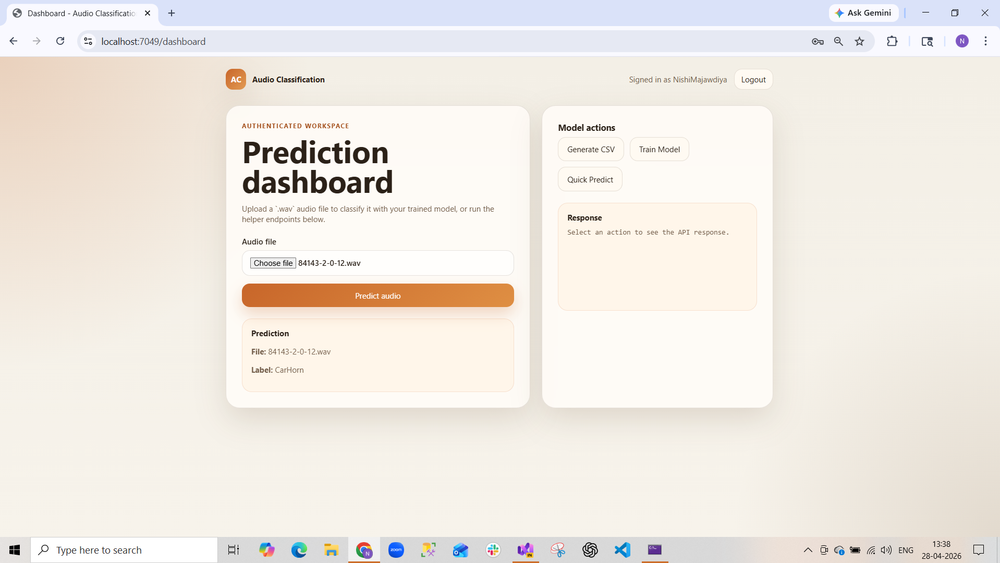

# 🎧 Audio Classification API (.NET 8 + ML.NET + JWT + SQL Server)

## 📌 Project Overview

This project is an **Audio Classification System** built using **ASP.NET Core (.NET 8)** and **ML.NET**.

👉 It allows you to:

* Upload audio files (.wav)
* Extract features from audio
* Train a machine learning model
* Predict audio labels (e.g., DogBark, CarHorn)
* Secure APIs using **JWT Authentication**
* Manage users with **Login & Register (SQL Server)**

---

## 🚀 Features

✅ Audio Classification using ML.NET
✅ Feature Extraction (Audio → Numeric Data)
✅ CSV Dataset Generation
✅ Model Training & Prediction
✅ JWT Authentication (Secure APIs)
✅ User Registration & Login
✅ SQL Server Integration
✅ Swagger UI for testing

---

## 🗂️ Project Structure

```
AudioClassification/
│
├── Controllers/        → API Controllers (Auth, Audio)
├── Data/               → DbContext + CSV file
├── Models/             → Entity Models
├── Services/           → ML + JWT Logic
├── Utils/              → Feature Extraction
├── AudioDataset/       → Training Audio Files
├── Screenshots/        → Project Screenshots
├── Program.cs          → Main Configuration
├── appsettings.json    → DB + JWT Config
```

---

## ⚙️ Technologies Used

* ASP.NET Core (.NET 8)
* ML.NET
* SQL Server
* Entity Framework Core
* JWT Authentication
* NAudio (Audio Processing)
* Swagger (API Testing)

---

## 🔐 Authentication Flow

1. User registers → stored in SQL DB
2. User logs in → receives JWT token
3. Token used to access protected APIs

---

## 🧪 API Endpoints

### 🔹 Auth APIs

| Method | Endpoint             | Description     |
| ------ | -------------------- | --------------- |
| POST   | `/api/auth/register` | Register user   |
| POST   | `/api/auth/login`    | Login & get JWT |

---

### 🔹 Audio APIs

| Method | Endpoint                  | Description            |
| ------ | ------------------------- | ---------------------- |
| GET    | `/api/audio/generate-csv` | Generate dataset CSV   |
| GET    | `/api/audio/train`        | Train ML model         |
| POST   | `/api/audio/predict`      | Upload audio & predict |

---

## 🧠 ML Flow

1. Audio (.wav) → Feature Extraction
2. Features → CSV
3. CSV → ML Model Training
4. New Audio → Features → Prediction

---

## ⚠️ Important Notes

* Only **PCM WAV files** are supported
* Unsupported audio files will be skipped
* Minimum dataset: 20–50 samples recommended

---

## 🔑 JWT Configuration

```json
"Jwt": {
  "Key": "THIS_IS_SUPER_SECRET_KEY_1234567890_ABCDEF",
  "Issuer": "AudioAPI",
  "Audience": "AudioUsers"
}
```

---

## ▶️ How to Run

```bash
dotnet restore
dotnet build
dotnet run
```

---

## 🧬 Run Migrations

```bash
dotnet ef migrations add InitialCreate
dotnet ef database update
```

---

## 🖼️ Screenshots

### 🔐 Login


### 📝 Register


### 📁 Generate CSV


### 🧠 Model Training


### 📊 Dashboard


### 📤 Output


## 📈 Output Example

```
Input: audio.wav
Prediction: DogBark
Accuracy: ~80-90% (depends on dataset)
```

---

## 👩‍💻 Author

**Nishi Majawdiya**

---

## ⭐ Summary

This project demonstrates:

* End-to-end ML pipeline
* Backend API development
* Authentication & Authorization
* Real-world audio processing

---
